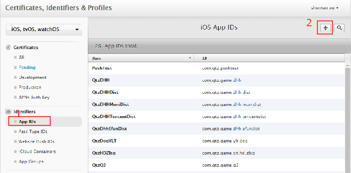
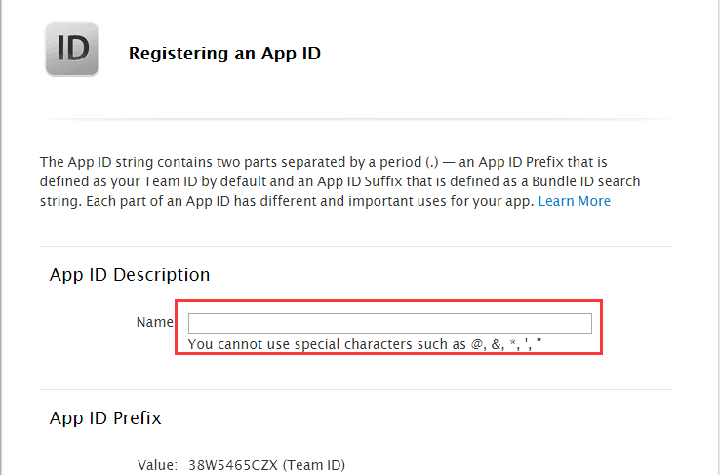
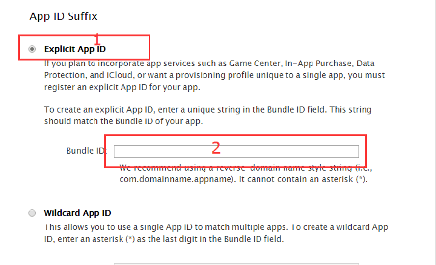
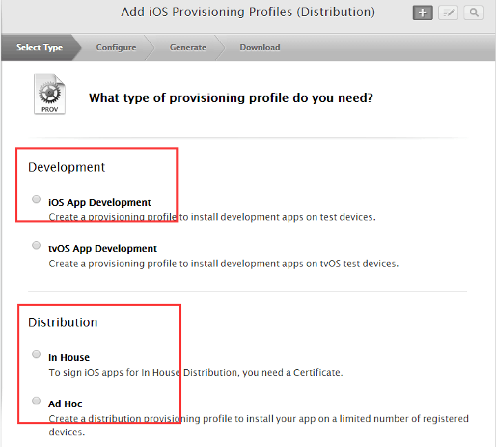
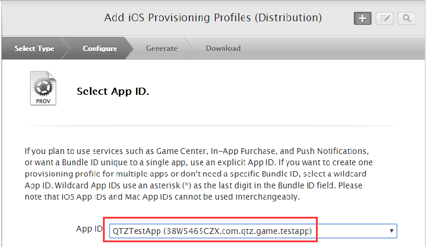
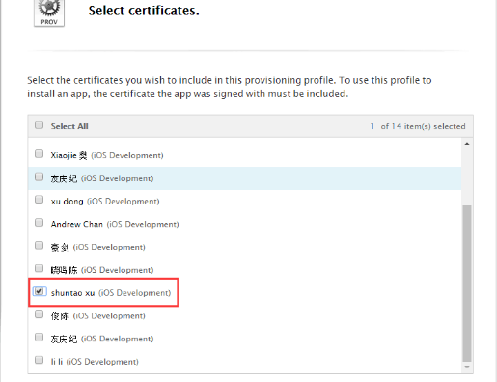
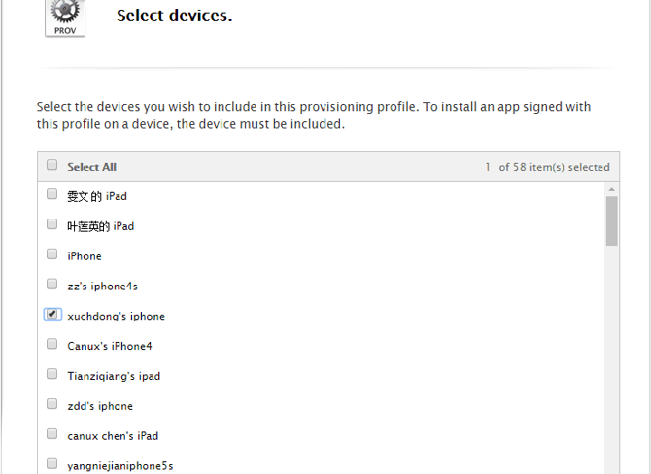
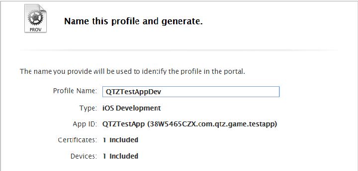

# iOS 管理员指引
------

iOS 管理员相对于普通开发者而言多了创建应用，添加测试设备，创建以及更新profile的功能。

## 申请开发账号并创建开发证书

[请参考iOS普通开发者指引](developer-tutorial.md)

> 注： 以下的操作都在developer.apple.com后台的【Certificates,Identifiers & Profiles】页面。

## 创建应用

- 打开创建应用界面，创建应用，按下图的操作

- 填写APP描述，描述名最好采用驼峰（CamelCase）方式命名

- 选择【Explicit App ID】， 填写Bundle ID，Bundle ID为com.qtz.game.xxx方式，xxx为类似q2,dhh等

- 点击【Continue】->【Register】->【Done】，即完成创建

## 添加测试设备

添加测试设备比较简单，可自行在developer.apple.com后台尝试操作，注意Device Name采用统一的格式: 名字缩写+工号's + 设备类型（iPhone7, iPhone6等）, 如： xst0065's iPhone7。

## 创建以及更新profile

> profile 有 Development 和Distribution两种版本，Development是用于开发使用的，管理员创建好之后普通开发者就直接下载就可以使用，Distribution是发布使用的证书。

- 点击【Provisioning Profiles】，然后右上角的“+”号。

- 选择是Development还是Distribution证书，Distribution中有In House和Ad Hoc， In House版本是发布版本，所有的设备都可以安装，Ad Hoc是发布的测试版本，只能添加的测试设备才可以运行。

- 选择创建的应用

- 选择开发者，可选择多个（Distribution Profile只能默认选择名字为擎天柱的证书）

- 选择调试的设备，可选多个

- 填写Profile的名字

- 点击【Done】，完成
