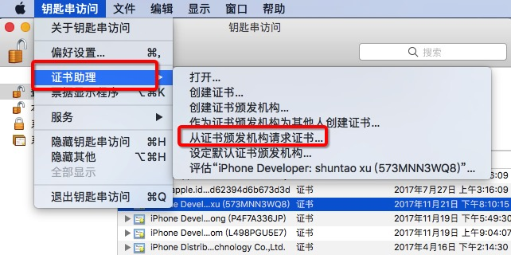
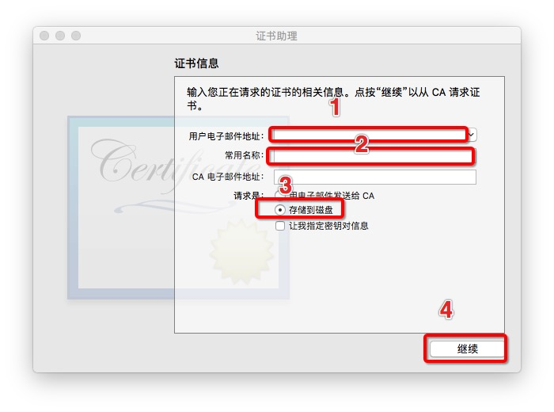
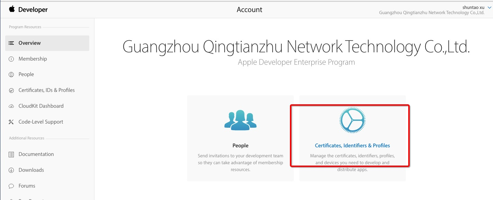
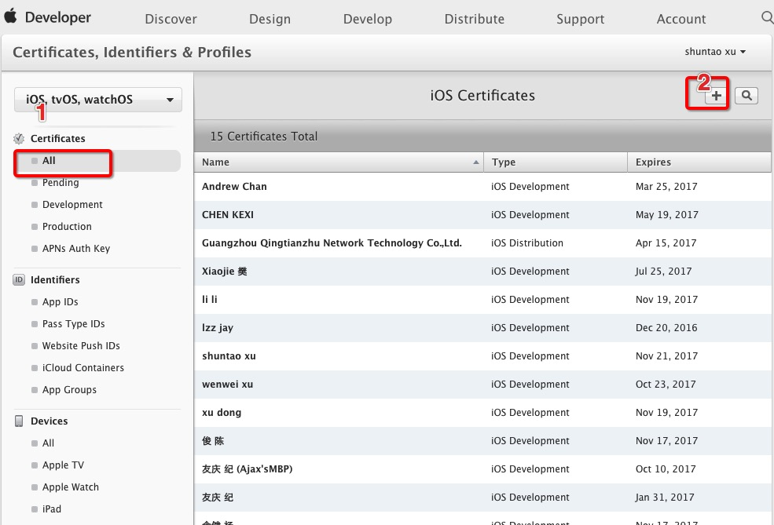
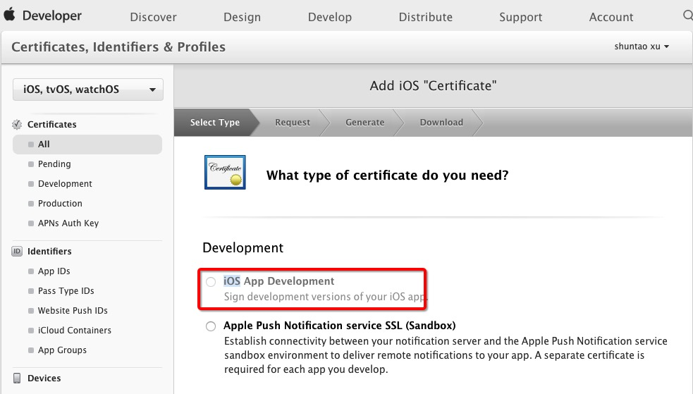
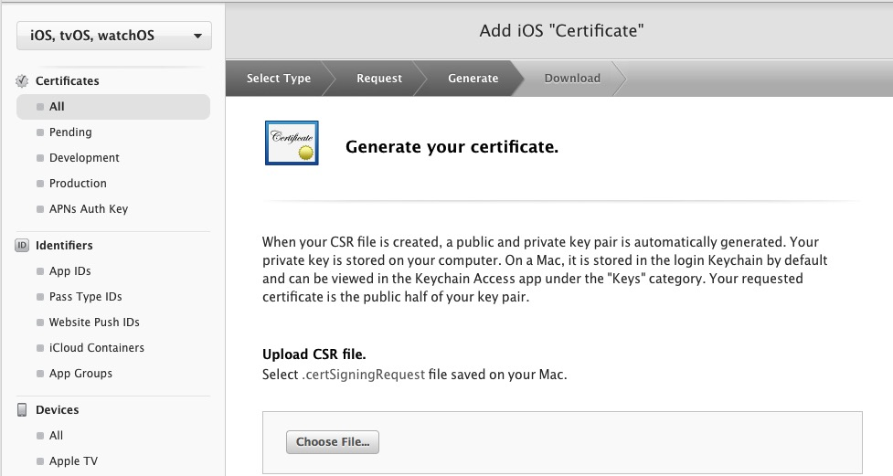
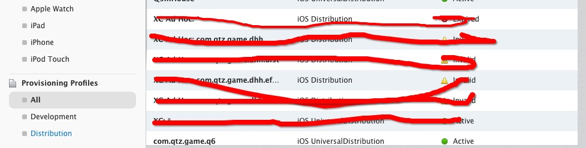

# iOS 普通开发者指引

## 申请iOS开发者账号

  [申请网址](https://appleid.apple.com/account?localang=en_US&appId=632&returnURL=https%3A%2F%2Fidmsa.apple.com%2FIDMSWebAuth%2Flogin.html%3FappIdKey%3D891bd3417a7776362562d2197f89480a8547b108fd934911bcbea0110d07f757%26path%3D%2Faccount%2F%26language%3DUS-EN%26rv%3D1#!&page=create)
  
  > 注：需要使用企业邮箱注册

## 创建开发者证书（cert）

#### 申请加入开发团队 
------

- 发邮件给@管理员申请需要加入擎天柱iOS开发团队
- @管理员会邀请你加入擎天柱iOS开发团队，注意查收邮件，打开邮件附带的连接，确认加入开发团队

#### 创建开发证书
------

- 创建certSigningRequest文件

    + 打开系统的钥匙串，点击【钥匙串访问】， 【证书助理】，【从证书颁发机构请求证书】，如下图：

    
                
    + 填写好用户地址，常用名称（名字的拼写如xushuntao，或是名字的缩写加工号如xst0065）,选中存储到磁盘，然后点击继续，如下图：

    
                
    + 保存到磁盘上，名字可以自己定义，最好是名字加工号的缩写（如xst0065.certSigningRequest)
			
- 创建开发者证书

    + 在[苹果开发者后台](https://developer.apple.com/account)登录，选择【Certificates,Identifiers & Profiles】,如下图：

    
              
    + 按照下图的红色数字提示点击

    

    + 选中【iOS App Development】，然后点击【continue】,会出现另一个界面，继续点击【continue】

    
              
    + 点击【Choose File】，在本地选择刚才创建的certSigningRequest文件，然后点击【continue】，会出现下载界面，点击【Download】,然后在本地双击下载的ios_developer.cer文件添加到钥匙串中。

    
		  

## 本地调试
	
 @管理员会创建一个应用，并创建好iOS Provisioning Profiles，进入刚才【Certificates,Identifiers & Profiles】页面，选中【Provisioning Profiles】，然后选中对应的profile，下载，双击，然后在xcode中配置好bundleID, 选中该证书，连接上开发设备即可开始在真机上调试。

> 注：@管理员 陈俊
